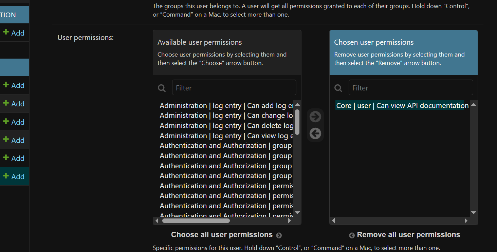

## example of .env
```
DEBUG=1
SECRET_KEY=your-secret-key

POSTGRES_DB=blogdb
POSTGRES_USER=bloguser
POSTGRES_PASSWORD=blogpass
POSTGRES_HOST=db
POSTGRES_PORT=5432

REDIS_URL=redis://redis:6379/1
MONGO_URL=mongodb://mongo:27017/

DJANGO_ALLOWED_HOSTS=localhost 127.0.0.1 [::1]
```

## 🔍 Checking Sessions in Redis

Redis sessions are stored in **DB1**, but the CLI connects to **DB0** by default.  
To inspect the session keys, run the following commands:

```bash
docker exec -it <your_redis_container_id> redis-cli
select 1
keys *
```

## 🛡️ API Documentation Viewing Permission

To allow a user to view the API documentation:

1. Open the **Django Admin Panel**.
2. Go to the **Users** section and select the desired user.
3. Scroll to the **Permissions** section (should be in box).
4. Enable the specific permission for viewing API documentation.

Once granted, the user will be able to access the docs interface.


## 🔐 Registration & Password Reset Guide (Development)

### 🖼️ Registration (with Profile Picture)
- The **profile picture** must be in **Base64** format.
- Example format: 'data:image/png;base64,iVBORw0KGgoAAAANSUhEUg.....'


### 📧 Email Activation (Development Mode)
- For development purposes, email verification is displayed in the **console**.
- It will output a link like this: http://localhost:8000/api/auth/activate/MTc/cqwa3k-b4c1f15c523bc78f105934402074689c 
- ✅ **Clicking this link will activate the account.**
- ❗ Until the account is activated, **login will not work.**


### 🔑 Forgot Password (Development Mode)
- Password reset also returns a **console link**: 
- http://localhost:8000/api/auth/reset-password-confirm/MTc/cqwa6m-297b8fd21e11528d5c36093d833f8c9e
- ⚠️ This URL is **not clickable** directly because it expects a **POST** request, not GET.


#### ✅ How to Reset Your Password:

1. Copy the two parts from the URL:
 - `uid`: `MTc`
 - `token`: `cqwa6m-297b8fd21e11528d5c36093d833f8c9e`
2. Open Swagger UI for the `reset-password-confirm` endpoint.
3. Use **POST** method put two parts in parameters and provide the following in the request body:
 {
   "new_password": "your_new_password"
 }
4. 🔒 This will successfully update your password.


